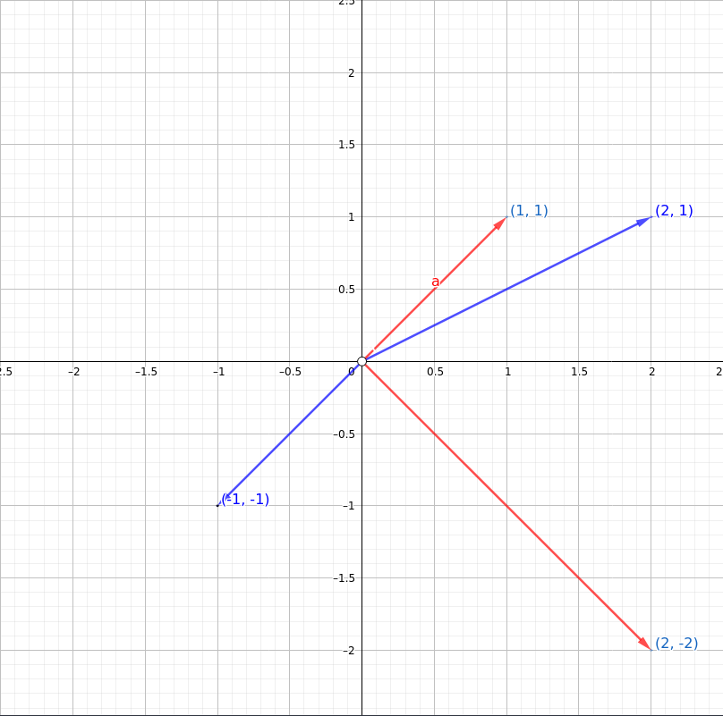

Exercise 2.20: Let us consider $b_1$,$b_2$,$b^\prime_1$,$b^\prime_2$, 4 vectors of $\mathbb{R}^2$ expressed  in the standard basis of $\mathbb{R}^2$ as

$$
b =\begin{bmatrix}
2\\
1
\end{bmatrix},\hspace{10pt}

b_2 =\begin{bmatrix}
-1\\
-1
\end{bmatrix},\hspace{10pt}

b'_1 =\begin{bmatrix}
2\\
-2
\end{bmatrix},\hspace{10pt}

b'_2 =\begin{bmatrix}
1\\
1
\end{bmatrix}
$$

and let us define two ordered bases $B = (b_1,b_2)$ and $B'=(b'_1,b'_2)$ of $\mathbb{R}^2$ i.e,

$$
B = 
\begin{bmatrix}
2 & -1\\
1 & -1 
\end{bmatrix},\hspace{10pt}

B' = 
\begin{bmatrix}
\hspace{8pt}2 & 1\\
-2 & 1 
\end{bmatrix},\hspace{10pt}

$$

1. Show that $B$ and $B'$ are 2 bases of $\mathbb{R}^2$ and draw those basis vectors.

Ans. the rank(B) and rank(B') = 2 which means, that the columns of both the matrices are linearly independent which also suggest that these columns can span the entire $\mathbb{R}^2$. Hence, according to our defination 2.14 we can conclude that $B$ and $B'$ are the bases of $\mathbb{R}^2$ respectively.

2. Compute the matrix ${P}_1$ that performs a basis change from $B'$ to $B$.

$$

P_1  B' = B \\
P_1 = BB'^{-1}\\
P_1 = 
\begin{bmatrix}
2 & -1\\
1 & -1
\end{bmatrix}
\begin{bmatrix}
.25 & -.25\\
.5 & .5 
\end{bmatrix}\\

\\

P_1 = \begin{bmatrix}
\hspace{8pt}0 & -1\\
-0.25 & -0.75 
\end{bmatrix},\hspace{10pt}\\
$$

Now, lets verify $P_1$ change our bases  from $B'$ to $B$:-
$$
P_1B' = B\\
\begin{bmatrix}
\hspace{8pt}0 & -1\\
-0.25 & -0.75 
\end{bmatrix}

\begin{bmatrix}
\hspace{8pt}2 & 1\\
-2 & 1
\end{bmatrix}
=
\begin{bmatrix}
2 & -1\\
1 & -1
\end{bmatrix}\\
$$

3. We consider $c_1,c_2,c_3$, 3 vectors of $\mathbb{R}^3$ defined in the standard basis of $\mathbb{R}$ as:

$$
c_1=
\begin{bmatrix}
1 \\
2 \\
-1
\end{bmatrix},
c_2=
\begin{bmatrix}
0 \\
-1 \\
2
\end{bmatrix},
c_3=
\begin{bmatrix}
1 \\
0 \\
-1
\end{bmatrix}\\
$$

and we define $C = (c_1,c_2,c_3)$.

a. Show that $C$ is a basis of $\mathbb{R}^3$, e.g., by determinants (see Section 4.1).

Ans. using laplace expansion we can calculate the determinat of $C$ as:
$$ 
\begin{aligned}

\det(C) &= \det \left (

\begin{bmatrix}
1 & 0 & 1 \\
2 & -1 & 0 \\
-1 & 2 & -1
\end{bmatrix}
\right )\\

&= (-1)^{1 + 1} \cdot 1
\det \left ( 
\begin{bmatrix}
-1 & 0\\
2 & -1
\end{bmatrix} \right) 

+ (-1)^{1 + 2} \cdot 0

\det \left ( 
\begin{bmatrix}
2 & 0\\
-1 & -1
\end{bmatrix}\right) 

+ (-1)^{1 + 3} \cdot 1

\det \left ( 
\begin{bmatrix}
2 & -1\\
-1 & 2
\end{bmatrix}\right) \\

&= (-1)^{2} \cdot 1
\left ( 
    1
\right) 

+ (-1)^{3} \cdot 0
\left ( 
    -2 
\right) 

+ (-1)^{4} \cdot 1
\left ( 
    3
\right) \\

&= (1) \cdot 1 + (-1) \cdot 0 + (1)\cdot 3\\
&= 1 + 0 + 3\\
&= 4

\end{aligned}
$$

hence, 
$$\det(C) = 4$$

Now, theorem 4.1 suggest that ***A*** is invertible if and only if $\det(A) \neq 0$ and from above we can clearly see that $\det(C) \neq 0$ which means, our matrix C is **invertible** and from section $2.2.2$ we know that a matrix invertible iff they they are non-singular which implies that $C$ can span the entire $\mathbb{R}^3$. hence, $C$ is a basis of $\mathbb{R}^3$

b. Let us call $C' = (c_1',c_2',c_3')$ the standard basis of $\mathbb{R}^3$. Determine the matrix $P_2$ that performs the basis change form $C$ to $C'$.

ans.
$$ 
\begin{aligned}
P_2C &= C'\\
P_2 &= C'C^{-1}\\
P_2 &= 
\begin{bmatrix}
1 & 0 & 0\\
0 & 1 & 0\\
0 & 0 & 1\\
\end{bmatrix}
\left ( 
\begin{bmatrix}
1 & 0 & 1\\
2 & -1 & 0\\
-1 & 2 & -1\\
\end{bmatrix}
\right)^{-1}\\
P_2 &=
\begin{bmatrix}
0.25 & 0.5 & 0.25\\
0.5 & 0.0 & 0.5\\
0.75 & -0.5 & -.25\\
\end{bmatrix}
\end{aligned}
$$

hence, $P_2$ is our matrix which converts $C$ to our standard basis.

4. We consider a homomorphism $\Phi: \mathbb{R}^2 \rightarrow \mathbb{R}^3$, such that
$$ 
\begin{aligned}
\Phi{(b_1 + b_2)} &= c_2 + c_3 \hspace{1in} \text{(1)}\\
\Phi{(b_1 + b_2)} &= 2c_1 -c_2 + 3c_3\hspace{.6in} \text{(2)}

\end{aligned}
$$

where $B = (b_1, b_2)$ and $C=(c_1,c_2,c_3)$ are ordered bases of $\mathbb{R}^2$ and $\mathbb{R}^3$, respectively.\
Determine the transformation matrix $A_{\Phi}$ of $\Phi$ with respect to the ordered bases $B$ and $C$.

Ans.
$$
\begin{aligned}
    
\Phi{(b_1 + b_2)} &= c_2 + c_3 \\
\Phi{(b_1)} + \Phi{(b_2)} &= c_2 + c_3\\
\Phi{(b_1)} &= c_2 + c_3 - \Phi{(b_2)}\tag{3}

\end{aligned}
$$

$$
\begin{aligned}
\Phi{(b_1 + b_2)} &= 2c_1 -c_2 + 3c_3\\
\Phi{(b_1)} - \Phi{(b_2)} &=  2c_1 -c_2 + 3c_3\tag{4}
\end{aligned}
$$

Putting $(3)$ in $(4)$ we get:
$$
\begin{aligned}
\Phi{(b_1)} - \Phi{(b_2)} &=  2c_1 -c_2 + 3c_3\\
c_2 + c_3 - \Phi(b_2) - \Phi(b_2) &= 2c_1 -c_2 + 3c_3\\
c_2 + c_3 - 2\Phi(b_2) &= 2c_1 - c_2 + 3c_3\\
-2\Phi(b_2) &= 2c_1 - c_2 + 3c_3 - c_2 - c_3\\
-2\Phi(b_2) &= 2c_1 - 2c_2 + 2c_3\\
\text{multiply both side -1:} \hspace{.5in}\\
2\Phi(b_2)  &= -2c_1 + 2c_2 - 2c_3\\
 \text{divide both side by 2:} \hspace{.5in}\\
\Phi(b_2)   &= -c_1  + c_2 - c_3 \hspace{1in} \text{(5)}\\
\end{aligned}
$$

Now, putting $(5)$ in $(3)$ we get:

$$
\begin{aligned}
    
\Phi{(b_1)} &= c_2 + c_3 - \Phi{(b_2)}\\
\Phi(b_1) &= c_2 + c_3 - (-c_1 + c_2 - c_3)\\
\Phi(b_1) &= \cancel{c_2} + c_3 + c_1  \cancel{-c_2} + c_3
\Phi(b_1) &= c_1 + 2c_3  \hspace{1in} \text{(6)}\\

\end{aligned}
$$

Now, we know that we need to find a transformation matrix $A_{\Phi}$ with respect to $B$ and $C$ which should satisfy $(5)$ and $(6) respectively i.e,:

$$
\begin{aligned}
\Phi(b_2)   &= -c_1  + c_2 - c_3 \\
\Phi(b_1) &= c_1 + 2c_3
\end{aligned}
$$

which means, our transformation matrix will be:
$$
A_\Phi = 
\begin{bmatrix}
   1 & -1 \\ 
   0 & 1 \\
   2 & -1 
\end{bmatrix}
$$

5. Determine $A'$, the transfomration matrix of $\Phi$ with respect to the bases $B'$ and $C'$.

ans. we know that 
$$
B' = 
\begin{bmatrix}
   2 & 1 \\ 
   -2 & 1 \\
\end{bmatrix}
,
C' = 
\begin{bmatrix}
   1 & 0 & 0 \\ 
   0 & 1  & 0\\
   0 & 0 & 1
\end{bmatrix}
$$

now, we can use the formula, (2.105) in the section 2.7.2 (Basis Change) to calculate our A':-
$$
\begin{aligned}

A' &= P_2 A_\Phi P_1\\
A' &= 
\begin{bmatrix}
0.25 & 0.5 & 0.25\\
0.5 & 0.0 & 0.5\\
0.75 & -0.5 & -.25\\
\end{bmatrix}
\begin{bmatrix}
   1 & -1 \\ 
   0 & 1 \\
   2 & -1 
\end{bmatrix}

\begin{bmatrix}
\hspace{8pt}0 & -1\\
-0.25 & -0.75 
\end{bmatrix}\\

A' &=
\begin{bmatrix}
   0.75 & 0 \\ 
   1.5 & 1 \\
   0.25 & -1 
\end{bmatrix}
\begin{bmatrix}
\hspace{8pt}0 & -1\\
-0.25 & -0.75 
\end{bmatrix}\\

A' &= 
\begin{bmatrix}
   0 & -0.75 \\ 
   0.25 & -0.75 \\
   0.25 & 0.5
\end{bmatrix}

\end{aligned}
$$

6. Let us consider the vector $x \in \mathbb{R}^2$ whose coordinates in B' are $[2, 3]^T$. In other words, $x = 2b'_1 + 3b'_2$\
a. calculate the coordinate of $x$ in B.

ans. the vector in the canonical basis will be: 

$$ 
\begin{aligned}

x &= 2b'_1 + 3b'_2\\
x &= 
2\begin{bmatrix} 
2 \\
-2\\
\end{bmatrix} 
+ 3\begin{bmatrix} 
1 \\
1 \\
\end{bmatrix} \\

x&= \begin{bmatrix} 
7 \\
-1 \\
\end{bmatrix} 

\end{aligned}
$$

now, to calculate the coordinate of x in B we simply transform x to the basis of B using our transformation matrix $P_1$

$$ 
\begin{aligned}
    
x' &= P_1\cdot x\\
x' &= 
\begin{bmatrix}
\hspace{8pt}0 & -1\\
-0.25 & -0.75 
\end{bmatrix}\cdot
\begin{bmatrix}
7\\
-1
\end{bmatrix}\\
x' &= 
\begin{bmatrix}
1 \\
-1 
\end{bmatrix}

\end{aligned}
$$

b. Based on that, compute the coordinates of $\Phi{(x)}$ expressed in $C$.

ans. Now because x' follows B. we can use $A_\Phi$ to calculate the coordinates of $\Phi(x)$ expressed in C. 

$$  
\Phi{(x)} = 
\begin{bmatrix}
1 & -1\\
0 & 1\\
2 & -1
\end{bmatrix}
\begin{bmatrix}
1 \\
-1 
\end{bmatrix}
=

\begin{bmatrix}
2 \\
-1 \\
3\\
\end{bmatrix}
$$

c. Then, write $\Phi(x)$ in terms of $c'_1,c'_2,c'_3$.

ans. using $P_2$ we can write $\Phi(x)$ in terms of $C'$ :

$$
\begin{aligned}
    
x_{c'} &= P_1\cdot \Phi(x)\\
x_{c'} &= 
\begin{bmatrix}
0.25 & 0.5 & 0.25\\
0.5 & 0.0 & 0.5\\
0.75 & -0.5 & -.25\\
\end{bmatrix}
\begin{bmatrix}
2 \\
-1 \\
3\\
\end{bmatrix}\\

x_{c'} &= 
\begin{bmatrix}
0.75 \\
2.5 \\
1.25\\
\end{bmatrix}\\

\end{aligned}
$$

so, $x_c'$ is a vector in the standard basis of $\mathbb{R}^3$

d. Use the representation of $x$ in $B'$  and the matrix $A'$ to find this result directly.

$$ 
\begin{aligned}
    x_{c'} &=  A'x\\
    x_{c'} &= 
\begin{bmatrix}
   0 & -0.75 \\ 
   0.25 & -0.75 \\
   0.25 & 0.5
\end{bmatrix}
\begin{bmatrix} 
7 \\
-1 \\
\end{bmatrix} \\

x_{c'} &= 
\begin{bmatrix}
0.75 \\
2.5 \\
1.25\\
\end{bmatrix}\\

\end{aligned}
$$

TODO: Check all the calculation because something doesn't add up.